# 【Agent】Agent对接json

> Source: https://docs.popo.netease.com/team/pc/r17pusa6/pageDetail/c304b411ddda4525a3dd1ee4128e0102?popolocale=zh-CN&popoHourSystem=24&appVersion=4.29.0&deviceType=4&popolocale=zh-CN&popo_hidenativebar=1&popo_noindicator=1&disposable_login_token=1
> Generated: 2026-04-20T08:41:56.192Z

---

## 一、版本规划

v11.3需求清单（智能组）

## 二、修订记录

| 版本号 | 修订时间 | 修订内容 | 修订人 |
| --- | --- | --- | --- |
| v1.0 | 2026.02.25 | 创建文档 | 小娥 |

## 三、需求背景

选型调研文档：Agent卡片生成技术选型调研

| 厂商 | 备注 |
| --- | --- |
| jason-render | 网站：https://json-render.dev/github：https://github.com/vercel-labs/json-render |
| 谷歌-a2ui | 公关文章：http://xhslink.com/o/7GGuXB8UmVIdemo和介绍：https://dojo.ag-ui.com/agent-spec-langgraph/feature/backend\_tool\_rendering
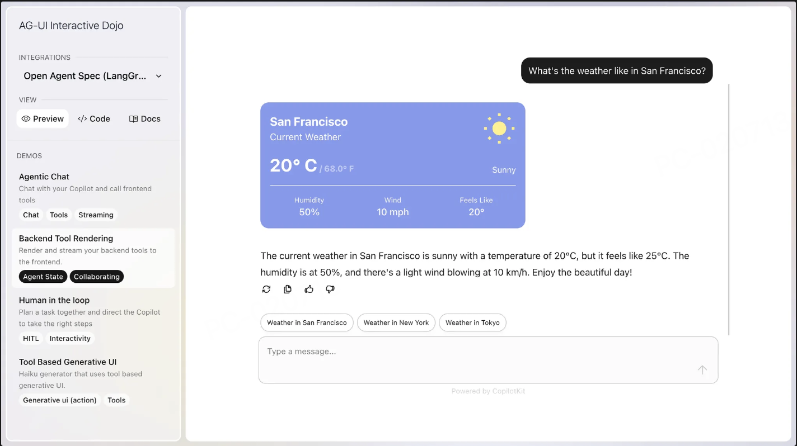

a2ui-composer后台：https://a2ui-composer.ag-ui.com/ |

## 四、需求描述

## 1、卡片列表

1

-   在【全局变量】下方新增一级菜单栏【卡片管理】

1

-   页面标题：卡片管理

1

-   展示内容为所有生成的卡片，若【卡片数量=0】，则页面展示展示内容为

1

-   大标题：Ai生成卡片

1

-   鼠标hover文案：

您可通过下方文本框输入想要生成的卡片样式/使用场景等方面的要求，AI将自动为您生成。

生成后，如需调整，您可通过指令进一步要求AI进行调整，或通过直接更改Json的方式改变卡片样式。

生成的卡片可在【工作流-对话节点-卡片】中进行选择使用。

1

-   小字说明：欢迎使用AI生成卡片功能，请在下方输入您需要生成的卡片要求。

1

-   输入框暗纹：可以在此处输入您的要求

1

-   按钮：生成

1

-   卡片按照更新时间倒序展示

1

-   分页器：一页最多展示20个卡片

1

-   鼠标hover在卡片上，展示3个文字链，从左至右分别是：查看、编辑、删除

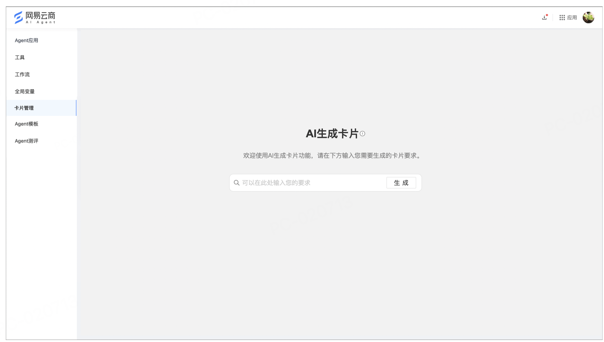

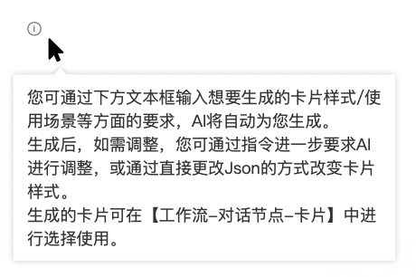

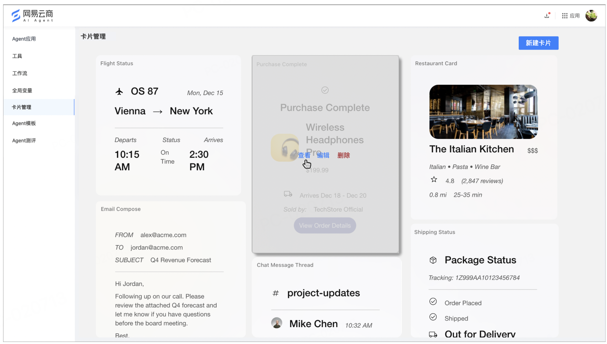

## 2、查看卡片

1

-   点击卡片中的【查看】，需要弹出【查看卡片弹窗】

1

-   弹窗标题：查看卡片

1

-   弹窗左侧：展示的是卡片样式，支持在卡片中进行交互（这是谷歌自带的，比如下方截图是生成的表单，表单的输入框就可以自由输入内容）

1

-   弹窗右侧（上）：组件的Jason，该Jason不支持手工编辑修改

1

-   弹窗右侧（下）：内容（此处跟随谷歌的定义，不同的卡片交互，这里展示的内容是不同的，有的是“为空状态时（empty）”和“非空状态时（filled）” 2个tab）

1

-   按钮：编辑、删除

1

-   编辑和删除的逻辑请详见本策划稿第3和4部分

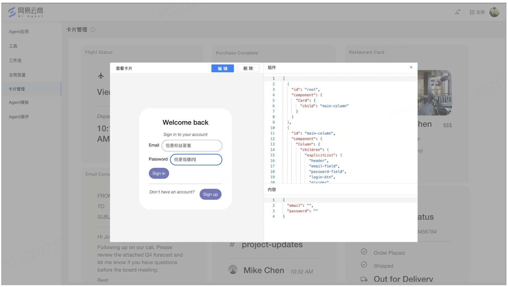

## 3、编辑卡片

1

-   2个入口均可进入【编辑卡片界面】：1是点击卡片上的编辑文字链，2是点击查看卡片弹窗中的编辑按钮

1

-   面包屑：卡片管理>编辑卡片

1

-   其中【卡片管理】为文字链，点击后可以回到卡片列表

1

-   左侧（上）：组件的Jason，该Jason支持手工组编辑修改

1

-   左侧（下）：内容（此处跟随谷歌的定义，不同的卡片交互，这里展示的内容是不同的，有的是“为空状态时（empty）”和“非空状态时（filled）” 2个tab）

1

-   中间：展示的是卡片样式，支持在卡片中进行交互（这是谷歌自带的，比如下方截图是生成的表单，表单的输入框就可以自由输入内容）

1

-   右侧：展示和Ai的对话框，支持点击【查看日志】查看修改的Jason片段

1

-   保存按钮：点击保存后，卡片的内容需要立即生效，返回到卡片列表页，同时toast提示“保存成功！”

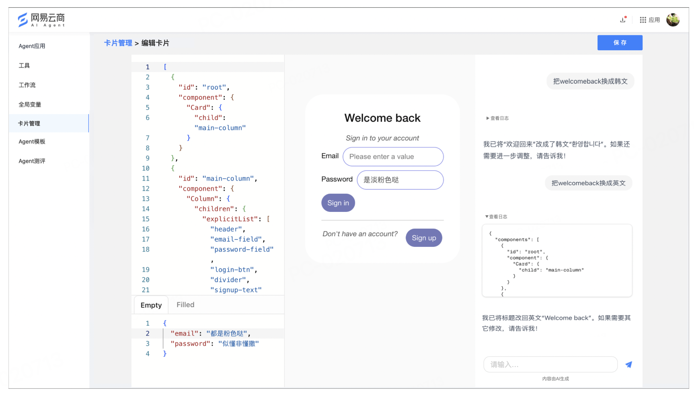

## 4、删除卡片

1

-   点击卡片中的删除文字链，需要弹出二次确认弹窗

1

-   弹窗标题：删除

1

-   小字说明：删除后，将不可恢复，请谨慎选择。

1

-   按钮：删除、取消

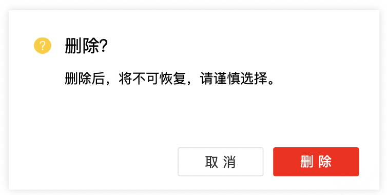

## 5、新建卡片

1

-   点击卡片列表中的【新建卡片】

1

-   面包屑：卡片管理>新建卡片

1

-   其中【卡片管理】为文字链，点击后可以回到卡片列表

1

-   大标题：Ai生成卡片

1

-   鼠标hover文案：

您可通过下方文本框输入想要生成的卡片样式/使用场景等方面的要求，AI将自动为您生成。

生成后，如需调整，您可通过指令进一步要求AI进行调整，或通过直接更改Json的方式改变卡片样式。

生成的卡片可在【工作流-对话节点-卡片】中进行选择使用。

1

-   小字说明：欢迎使用AI生成卡片功能，请在下方输入您需要生成的卡片要求。

1

-   输入框暗纹：可以在此处输入您的要求

1

-   按钮：生成

1

-   点击生成后，面包屑不变，需要立即展示编辑卡片的界面

1

-   保存按钮：点击保存后，toast提示“创建成功！”，同时跳转到卡片列表页面，在列表中可见新创建的卡片

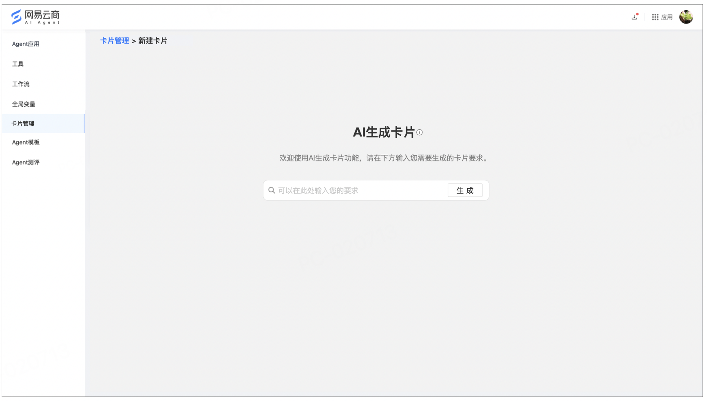

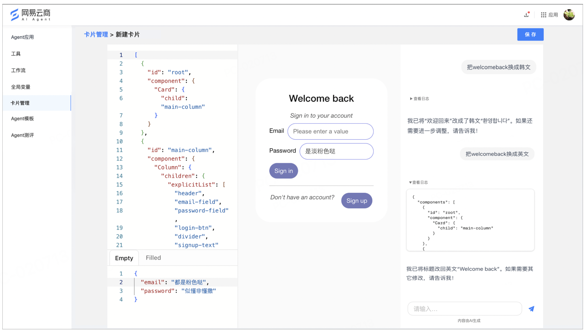

## 6、使用卡片

1

-   支持在【工作流-对话节点-卡片选择】中引用自定义的卡片

1

-   客户在卡片中的交互行为的传参需要传回Agent（该部分的交互需要等调研结束后补充完善）

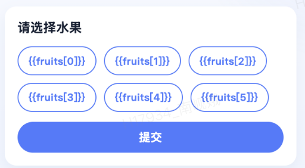

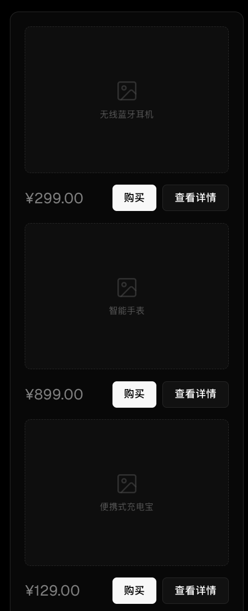

## 7、计费规则

单独计费