# 【Agent】Agent对接长期记忆Read Only

> Source: https://docs.popo.netease.com/team/pc/r17pusa6/pageDetail/de983275170e46719d5515e7a9b872a5
> Generated: 2026-03-18T02:46:49.156Z

---

## 一、版本规划

v11.3需求清单（智能组）

## 二、修订记录

| 版本号 | 修订时间 | 修订内容 | 修订人 |
| --- | --- | --- | --- |
| v1.0 | 2026.02.27 | 创建文档 | 小娥 |

## 三、说在前面

1

-   可参考的开源项目有：Mem0、Zep、 LangChain和spring的记忆模块

1

-   mem0:[https://mem0.ai/](https://mem0.ai/)

1

-   zep：[https://github.com/getzep/zep](https://github.com/getzep/zep)

1

-   langchain：[https://github.com/langchain-ai/langchain](https://github.com/langchain-ai/langchain)

1

-   spring：[https://java2ai.com/docs/frameworks/agent-framework/advanced/memory](https://java2ai.com/docs/frameworks/agent-framework/advanced/memory)

1

-   本期对接mem0的长期记忆能力。即仅支持长期记忆的录入、存储，和检索

1

-   分层记忆架构包含内容的对比，如下：

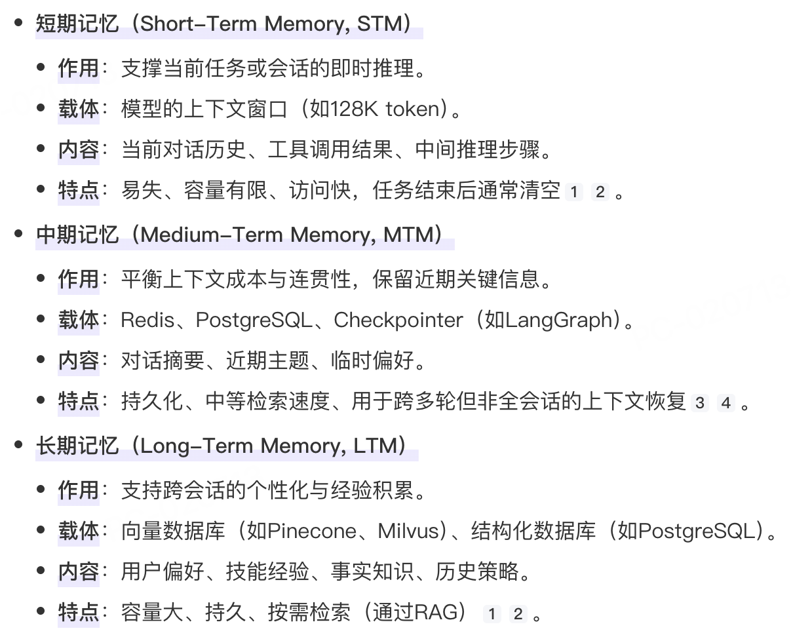

1

-   memory选型评估（之前云信做过，文档内容详见：[【记忆】效果评估](https://docs.popo.netease.com/lingxi/e76332bffd8a474da6b5e0048c323a94?xyz=1755587539970&appVersion=4.22.0&deviceType=4&popo_hidenativebar=1&popo_noindicator=1&xyz=1755589119088&appVersion=4.25.1&deviceType=4&popo_hidenativebar=1&popo_noindicator=1&disposable_login_token=1&appVersion=4.26.2&deviceType=4&popo_hidenativebar=1&popo_noindicator=1&disposable_login_token=1#edit)）

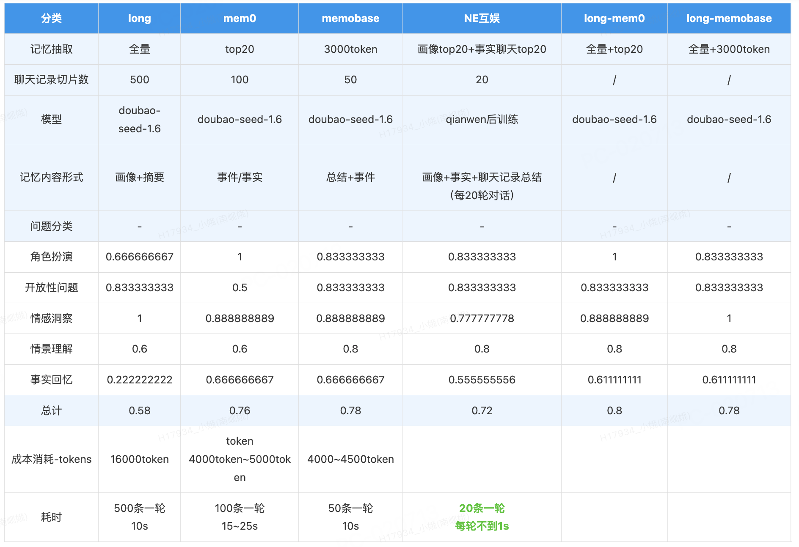

## 四、需求描述

## 1、记忆库 列表

创建时间

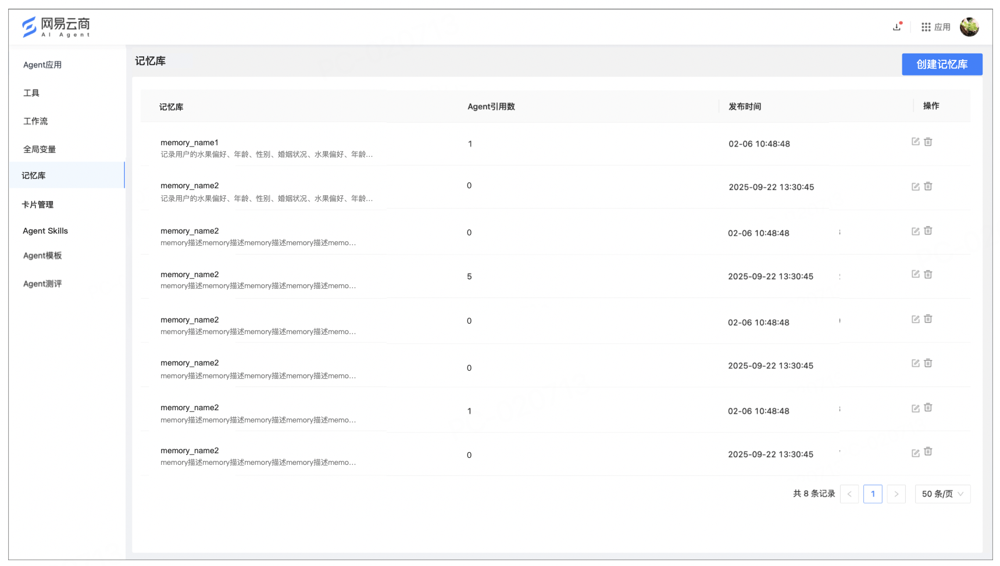

## 2、创建 记忆库

1

-   记忆库名称只能使用英文字母、数字、下划线，并以英文字母开头

1

-   此处和工具、工作流的名称创建限制条件保持一致

1

-   字符限制也与工具、工作流的字符限制保持一致

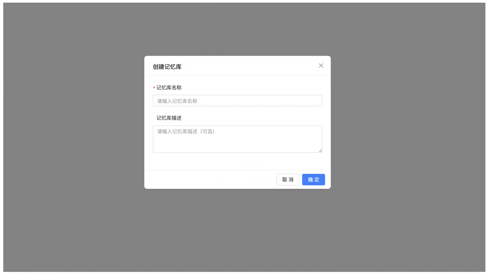

## 3、查看记忆

1

-   主要通过用户 UID 数据隔离的核心标识，保障同一记忆库中不同使用主体的记忆数据独立。

1

-   需要@开发 帮忙看一下，是否可以和在线会话记录的访客唯一标识一样的逻辑去记录

1

-   Agent/机器人批量测评：不记录记忆

1

-   机器人测试：不记录记忆

1

-   Agent调试窗口：需要记录记忆，产生的虚拟会话，记录在客服身上，该客服在前面提到的场景下多次测试，都是通用这一套记忆

1

-   Agent机器人应答、Agent坐席辅助：需要记录记忆，记录在访客身上

1

-   智能体和记忆库绑定后，由智能体产生的记忆需要在记忆库中by用户去进行记录。一个智能体仅支持绑定1个记忆库，1个记忆库支持被n个智能体绑定。

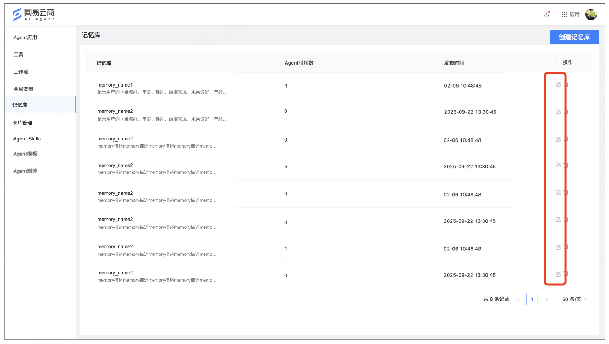

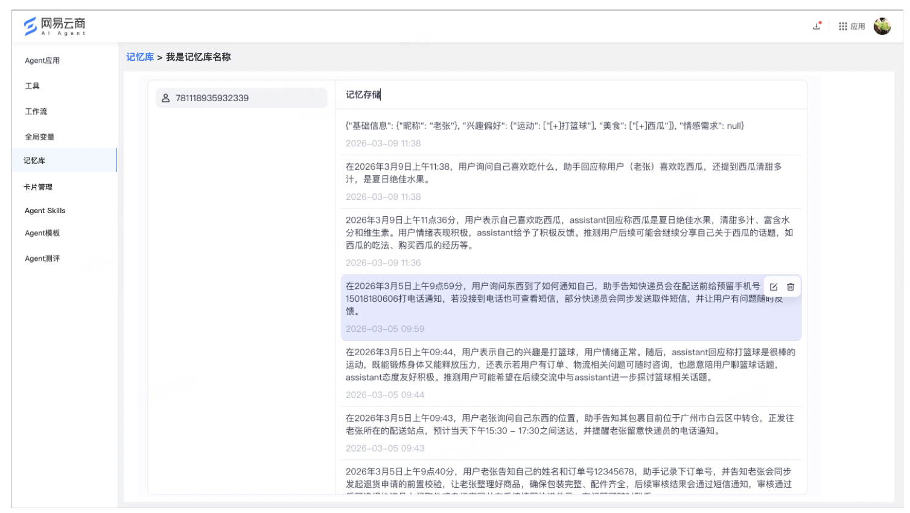

## 4、编辑记忆

1

-   单个记忆的字符长度，需要和mem0底层的限制保持一致，这块需要@开发 具体先看一下

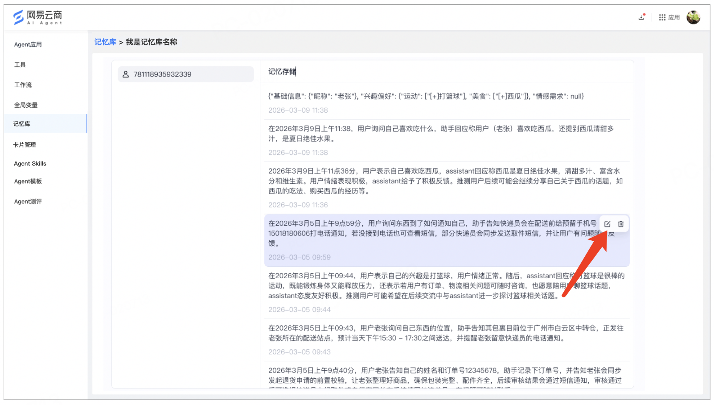

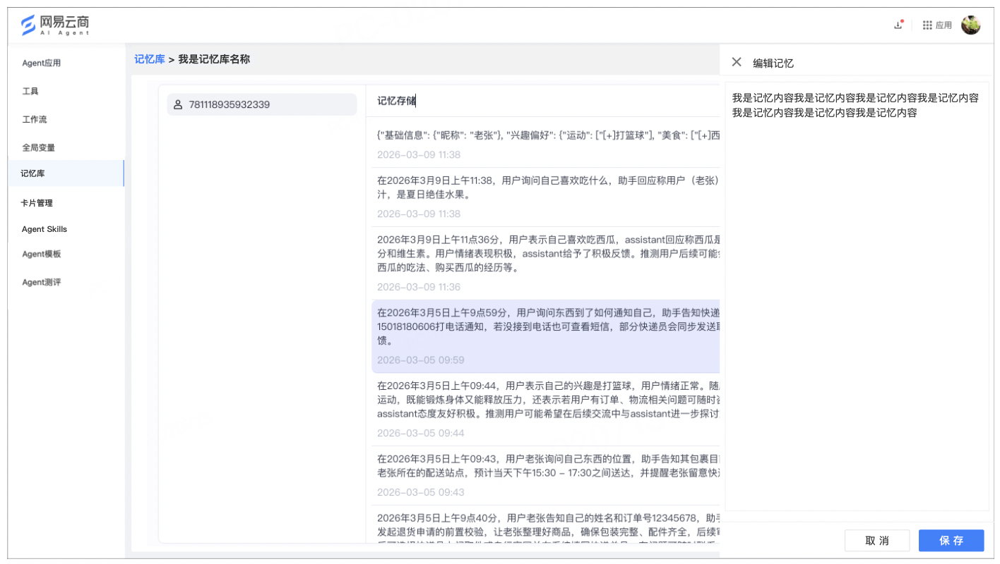

## 5、删除记忆

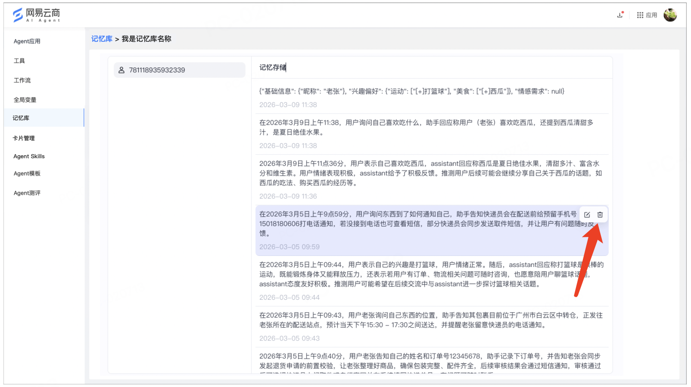

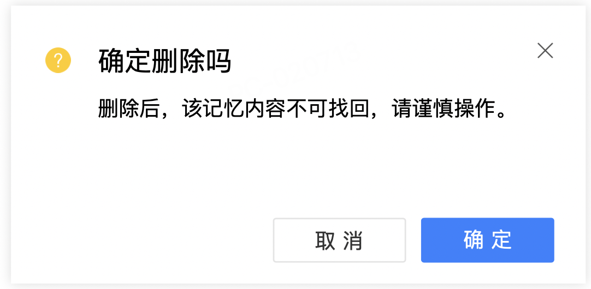

## 6、删除记忆库

1

-   删除逻辑需要再确认下，看是否和目前线上的工具及工作流的删除保持一致，还是重新设计一套更加合理的

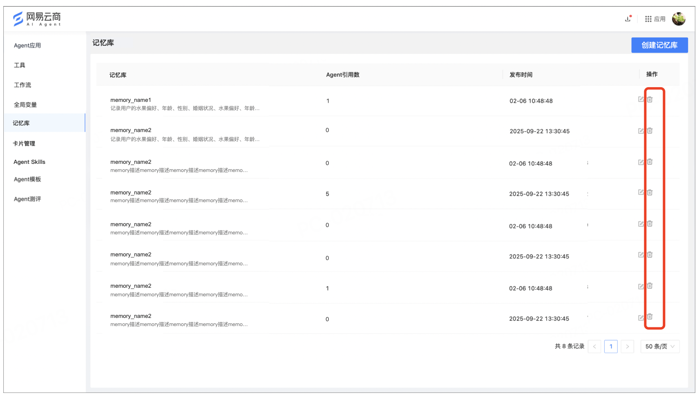

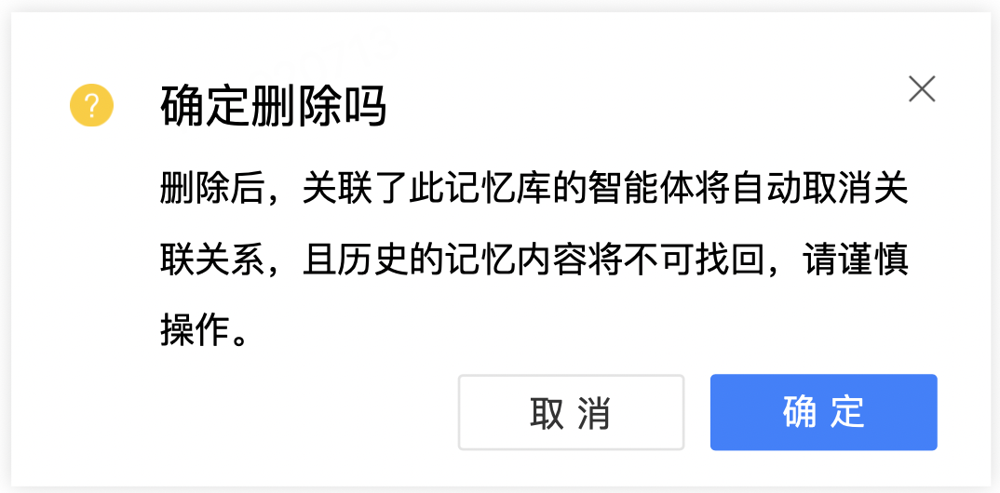

## 7、关联 记忆库

1

-   一个智能体只能添加一个记忆库，一个记忆库可以被添加到多个智能体中。

1

-   关联后，由当前智能体产生的记忆默认记录在关联的记忆库中。

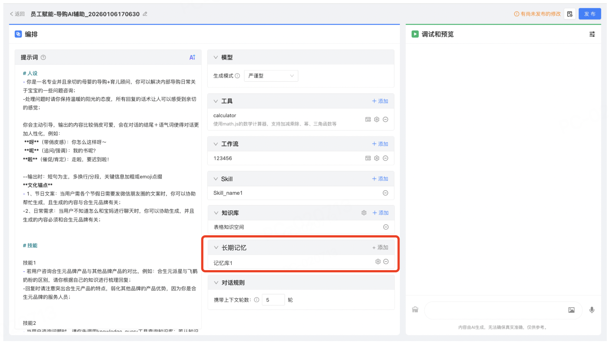

## 8、录入及召回记忆

💡

此part强依赖mem0框架，请开发根据mem0的调研结果，重点评估方案的可行性

## 1）录入时机（本期先不额外在mem0的框架上增加产品逻辑，所以录入时机这部分本期先不做，后面有需要单独提）

1

-   本期需要支持P0的录入时机方案，即“当LLM识别到需要录入时，便立即录入”：

| 录入时机 |  | 需求描述 | 举例 | 优先级 |
| --- | --- | --- | --- | --- |
| LLM识别到需要录入 | Agent提示词提到 | 1LLM根据Agent提示词内容，判断是否要录入到记忆库中，以及将什么内容录入1客户在Agent提示词中写到“需要记录/记住”等相关语义的内容时，需要强制按照Agent要求，根据上下文中提及的关键信息录入到长期记忆中 | 
1-   比如，如果在Agent提示词中写到类似“记录到长期记忆”、“一定要记住”、“别忘了”时，就需要立即根据上下文中提到的相关内容记录到长期记忆中

 

1-   🖕Agent提示词描述：和客户索要姓名和年龄，并记录到记忆库中

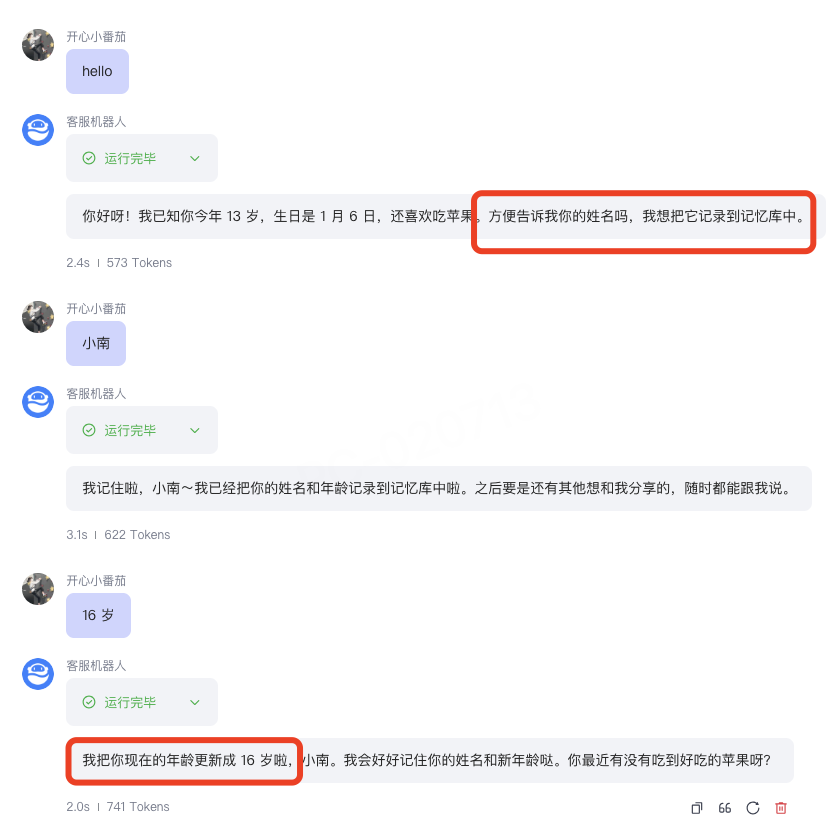

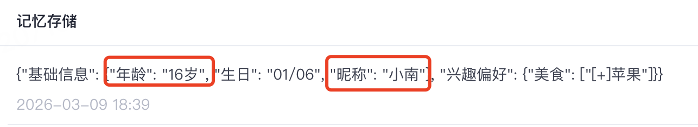

  | P0 |
| 上下文对话提到 | 1LLM根据上下文内容，判断是否要录入到记忆库中，以及将什么内容录入1当用户在和Agent对话中，如果说到“需要记录/记住”等相关语义的意图时，需要强制按照客户要求，根据上下文中提及的关键信息录入到长期记忆中 | 

1-   比如用户提到类似“记录到长期记忆”、“一定要记住”、“别忘了”等时，就需要立即根据上下文中提到的相关内容记录到长期记忆中

 

1-   🖕客户：你还记得我生日是哪天嘛？

1-   🖕Agent：不记得了

1-   🖕客户：我生日是1.6日

1-   🖕Agent：好的我这次记住了

 

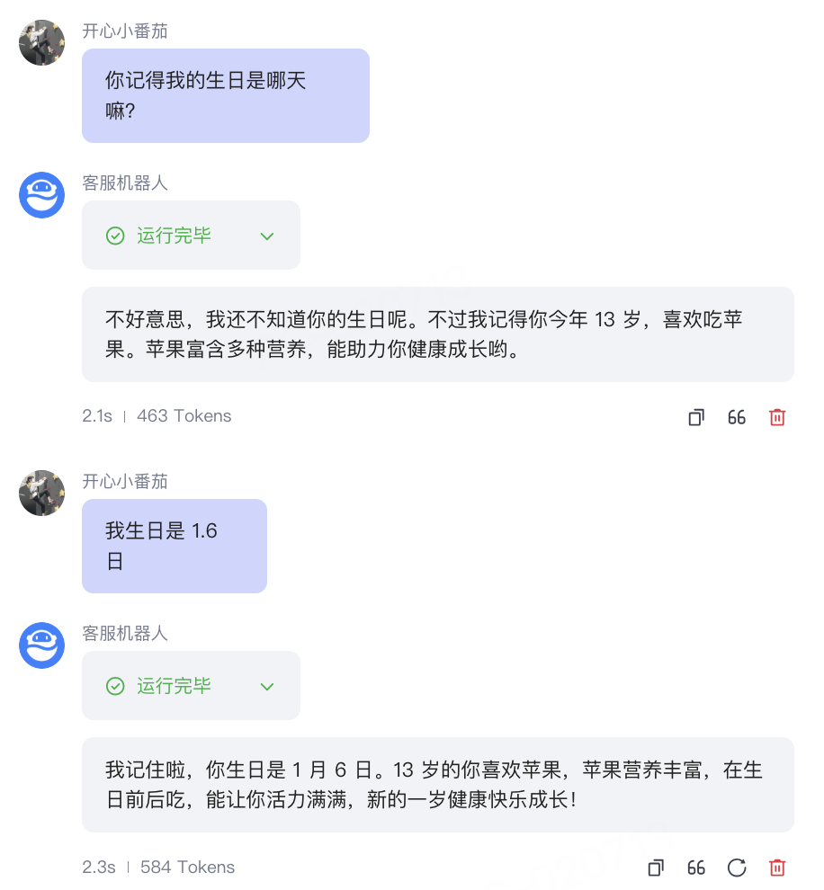

 

  | P0 |
| 工程强制要求录入 | 工作流要求录入 | 当工作流流转到长期记忆录入节点时，需按要求将信息录入至长期记忆库中 | 

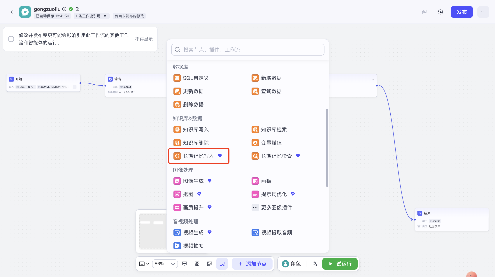

 | P1 |
| 要求对话总结 | 针对每一条用户提问和Agent回答，都进行总结后，自动记录到长期记忆中 | 

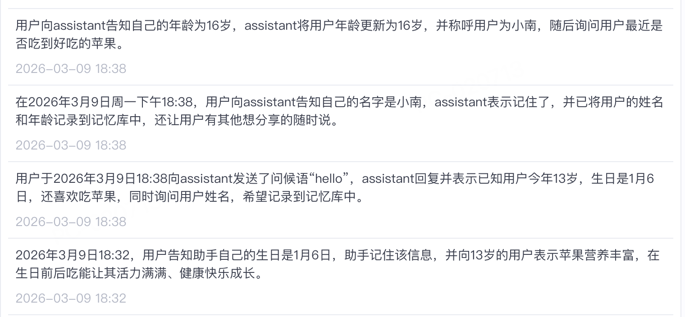

 | P1 |

## 2）录入记忆

## a‘ 数据隔离

1

-   主要通过用户 UID 数据隔离的核心标识，保障同一记忆库中不同使用主体的记忆数据独立。

1

-   智能体和记忆库绑定后，由智能体产生的记忆需要在记忆库中by用户去进行记录。一个智能体仅支持绑定1个记忆库，1个记忆库支持被n个智能体绑定。

## b‘ 多层级记忆

1

-   支持将指定记忆属于某个特定的 User（用户个人偏好）、Agent（这个 AI 助手的设定）或 Session（仅限本次谈话）。

| 层级 (Layer) | 对应 ID | 记忆内容举例 | 业务逻辑 |
| --- | --- | --- | --- |
| 用户层 (User) | user\_id | “我不吃香菜”、“我是产品经理”。 | 永久性个人偏好。无论用户换到哪个聊天窗口，这些记忆都紧随其后。 |
| 智能体层 (Agent) | agent\_id | “本助手的语气要专业”、“禁止回答代码问题”。 | 全局指令与常识。定义这个 AI 角色的“性格”和“专业边界”。 |
| 会话层 (Session) | run\_id | “刚才提到的那个 Bug 修复了吗？” | 临时上下文。仅在当前对话任务中有效，任务结束或开启新话题时，这些记忆权重降低。 |

## c‘ 事实提取

1

-   当对话发生时，LLM识别到有内容需要录入记忆库了，Mem0 内部的 LLM（大模型）会充当一个“速记员”，它不会记下所有的口水话（如“你好”、“哈哈”），而是执行以下操作：

1

-   从原始对话中提炼出“原子化”的事实事实。

1

-   例子： 用户说“我最近在负责云商的产品项目，压力有点大”，系统会提取出：{"user\_job": "Product Manager", "project": "Cloud Commerce"}。

## d‘ 语义去重

1

-   如果用户重新说了一遍之前提到过的信息，mem0会自动识别这是重复信息，不再重复录入。——这是mem0内部的去重逻辑

## e’ 冲突处理

这是 Mem0 最核心的逻辑。每当有一个新事实提取出来，它会先去旧的记忆库里通过“语义搜索”找到最相似的几条记忆，然后交给 LLM 做判断，执行以下四个动作之一：

| 动作 | 触发条件（规则） | 结果示例 |
| --- | --- | --- |
| ADD (新增) | 这是一个全新的信息，记忆库里完全没有相关的记录。 | 库里没写过你喜欢喝咖啡 $\\rightarrow$新增：用户喜欢拿铁。 |
| UPDATE (更新) | 新信息补充了旧信息，或者修正了之前的描述。 | 库里写你做支付产品，新信息说你现在转去做 AI 助手 $\\rightarrow$更新岗位。 |
| DELETE (删除) | 新信息明确否定了旧信息（发生冲突）。 | 你说“我不做产品经理了”，系统会删除之前关于你 PM 身份的记录。 |
| NOOP (无操作) | 新信息和库里已有的信息完全一致，不需要任何变动。 | 再次提到你是产品经理 $\\rightarrow$忽略，不产生多余记录。 |

## f‘ 时间衰减

支持系统配置规则，让一些很久不被提到的陈旧记忆逐渐“模糊”或被降低权重（类似于人类的遗忘）。

## g‘ 召回记忆

1

-   此处和产品方案关系不大，主要还是看mem0的检索召回逻辑是怎样的；

1

-   embedding、rerank、大模型召回在mem0后台都有开关的

1

-   召回的记忆不要支持输出给用户，而是传递给Agent基座模型润色和理解后统一输出；

## 9、调用日志

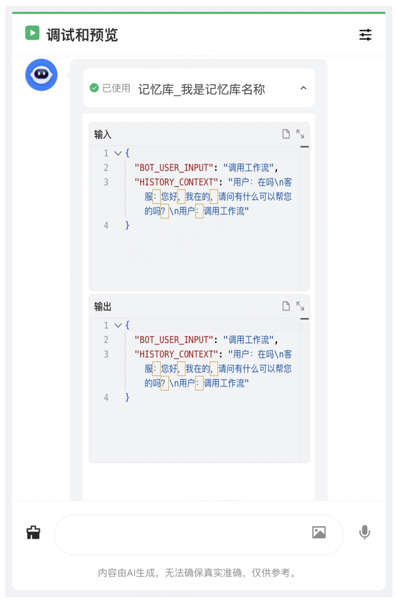

## 10、消耗明细

1

-   写入 长期记忆过程中，调用几次大模型就要扣几次大模型调用费用

1

-   需要新增消耗类型：Agent-长期记忆

1

-   每次写入大概都是2次大模型调用量

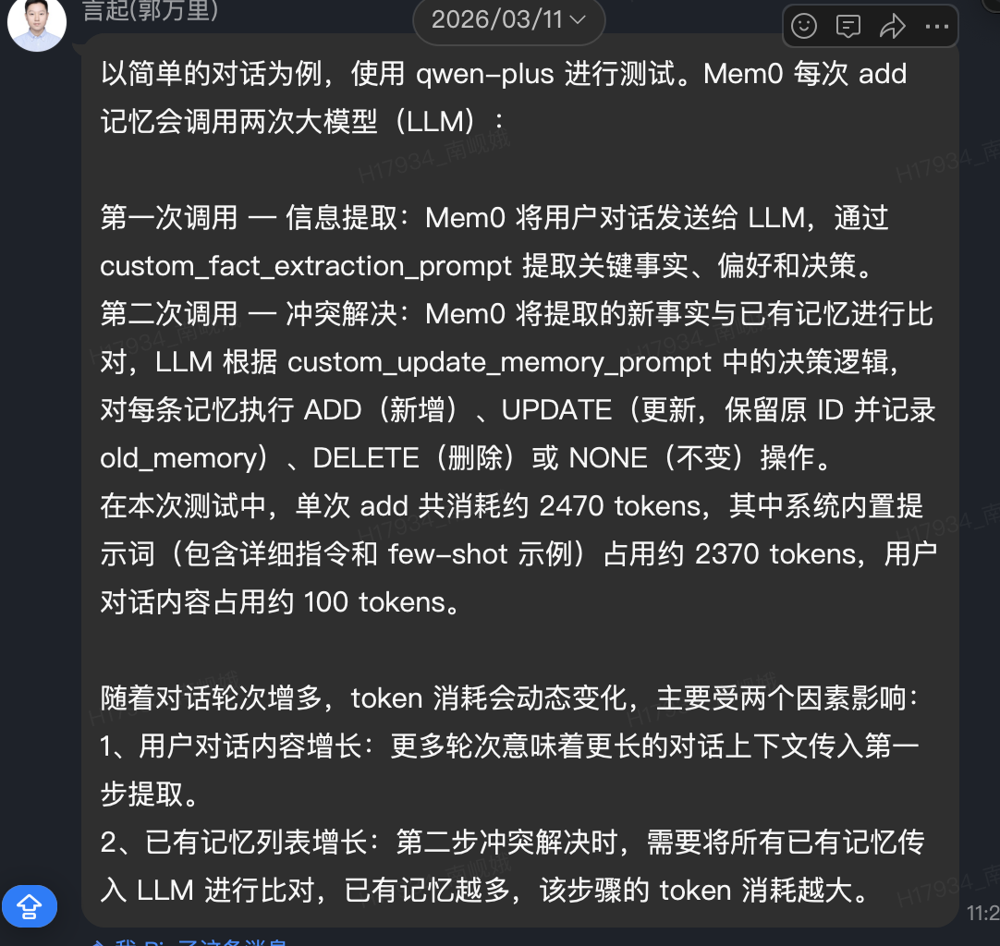

1

-   【应用及功能】新增选项：Agent-长期记忆

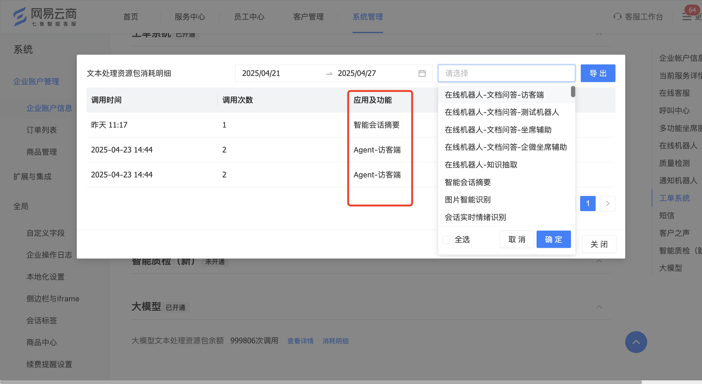

## 11、白名单功能

该功能需要支持白名单开启。只有开启了白名单的客户，才可在前端看到【记忆库列表】和【Agent关联记忆库】的模块。

## 12、其他需要开发协助调研的内容

1

-   长期记忆存在在哪里的，是在向量数据库中，还是md文档中，还是？

1

-   ——该调研结果决定了我们是否存在比较大的成本，如果有，可能还要出一套对应的售卖方案。我自己问了下gemini，她的答复如下，还需开发协助确认：

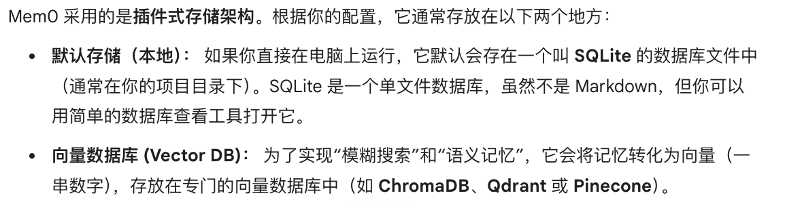

1

-   写入一次记忆库，会调用几次大模型？召回一次记忆库，会调用几次大模型？

1

-   根据我收集到的信息，我理解可能：写入一次记忆库，调用1次大模型，召回一次记忆库，不调用大模型，但是将召回内容需要给到基座大模型后润色输出，此处会调用1次大模型