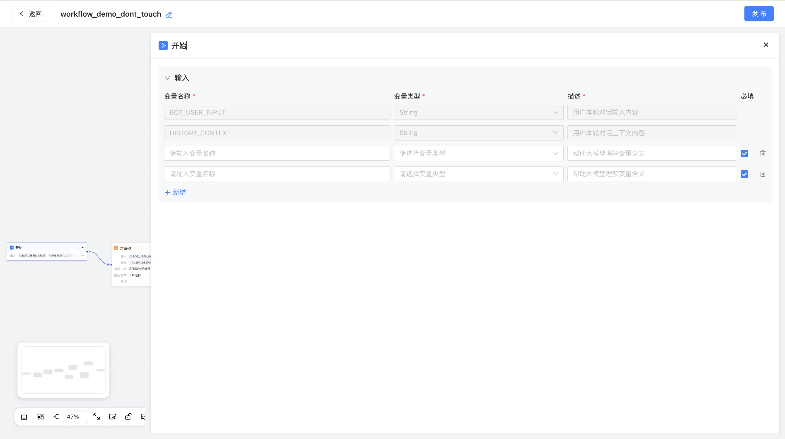

# 【Agent】Agent工作流面板调宽后组件样式问题只读

> Source: https://docs.popo.netease.com/team/pc/r17pusa6/pageDetail/f147abb928254094b817db363f53a570
> Generated: 2026-03-12T08:43:01.317Z

---

## 一、版本规划

v11.3需求清单（智能组）

## 二、修订记录

| 版本号 | 修订时间 | 修订内容 | 修订人 |
| --- | --- | --- | --- |
| v1.0 | 2026.02.25 | 创建文档 | 小娥 |

## 三、需求描述

开始节点的设置面板由于是等比例拉宽的，导致【变量名称】和【变量类型】过长，【描述】反而过短。

本期需要将【变量名称】和【变量类型】设置为固定宽度

