# 【智能】Agent支持工作流试运行

> Source: https://docs.popo.netease.com/team/pc/r17pusa6/pageDetail/ebf7216f3d5f4795b0c79a9900129b37
> Generated: 2026-02-04T12:13:21.828Z

---

## 一、版本规划

在线11.2需求清单

## 二、修订记录

| 版本号 | 修订时间 | 修订内容 | 修订人 |
| --- | --- | --- | --- |
| v1.0 | 2026.01.09 | 创建文档 | 小娥 |

## 三、需求背景

目前工作流搭建完成后，需要到agent调试窗口去调试，有问题，还要再回到工作流去调整。来回跳转异常麻烦。本期支持直接在工作流编辑界面【调试并试运行】

## 四、优秀方案调研

| 竞品 | 截图 |
| --- | --- |
| 腾讯云 | 
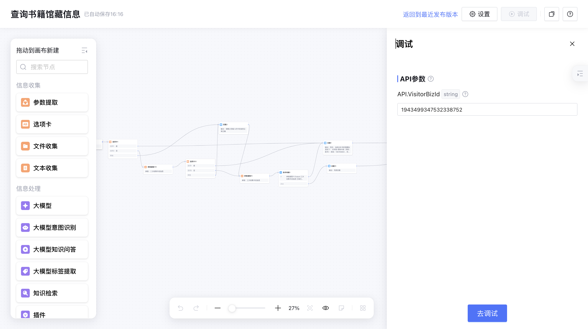

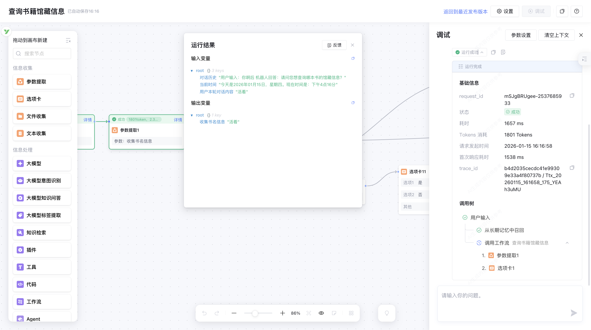

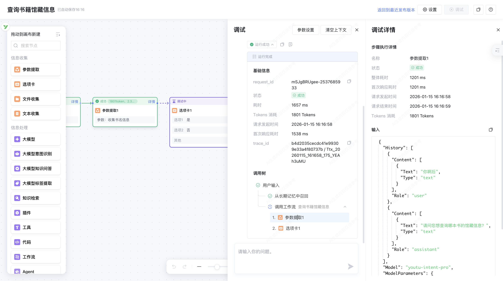

  |
| coze | 

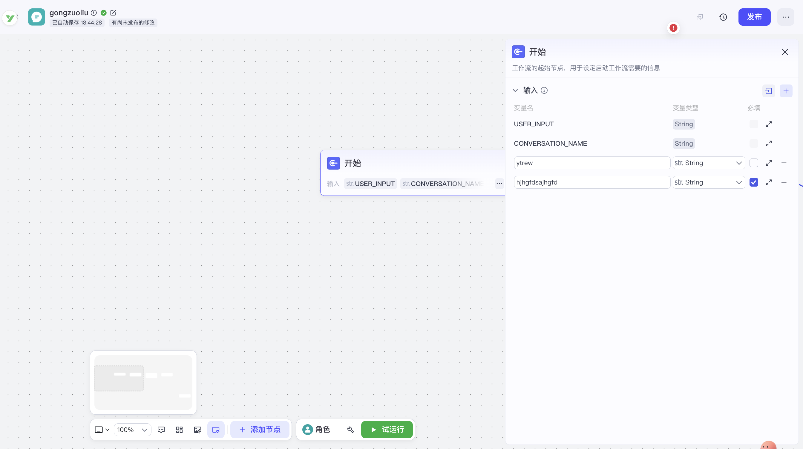

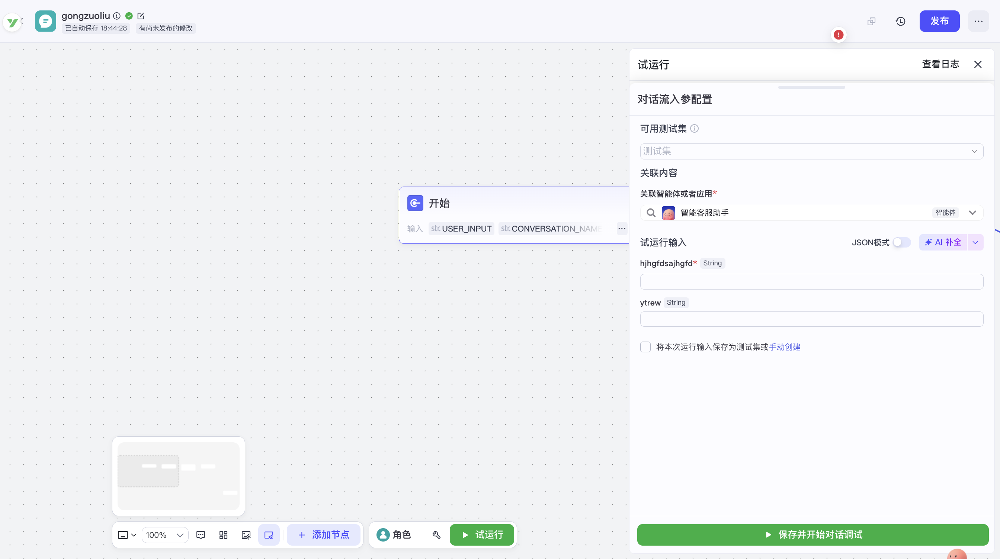

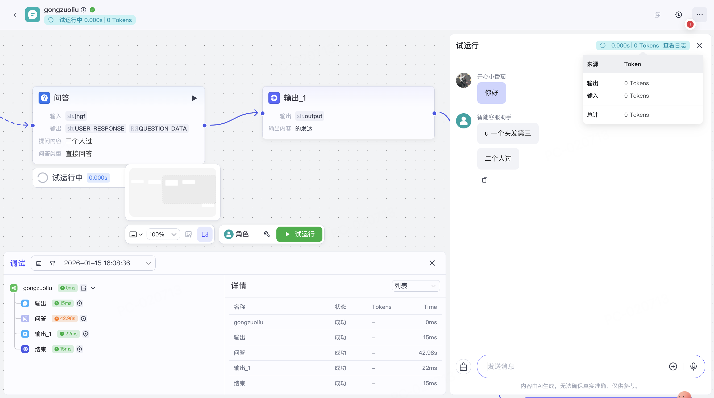

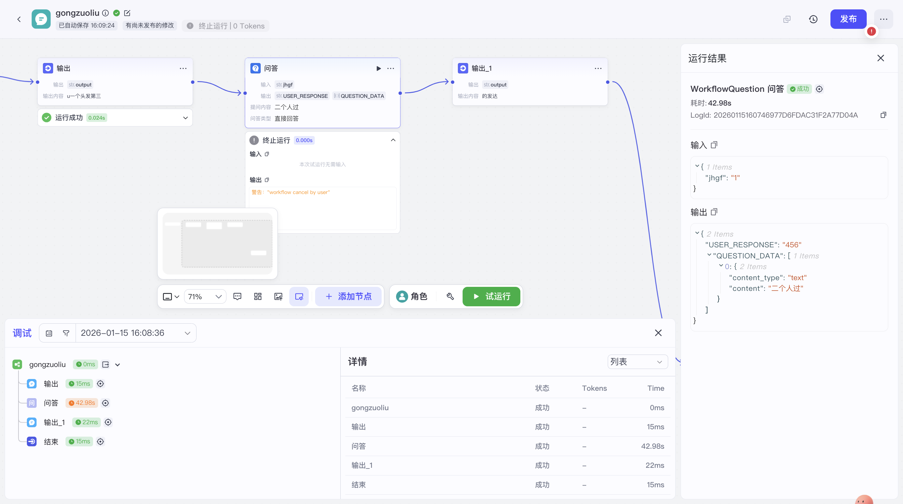

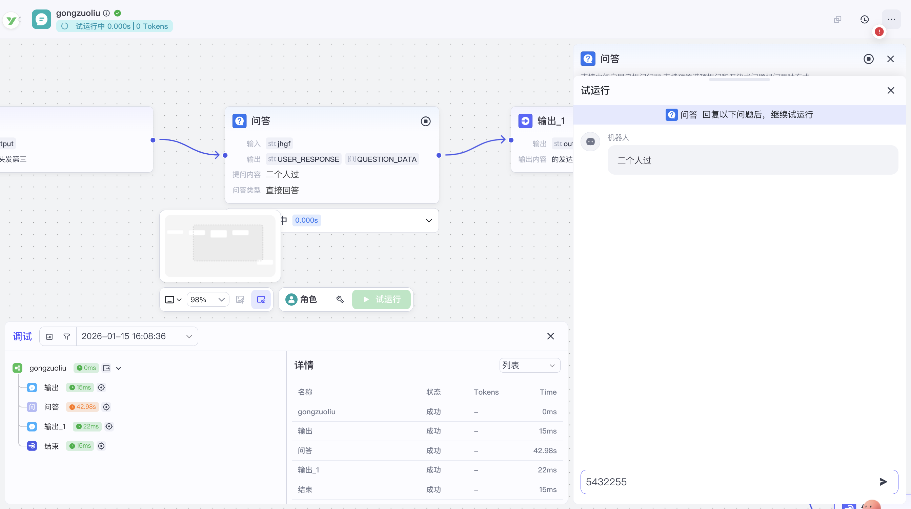

  |
| AI排障 | 

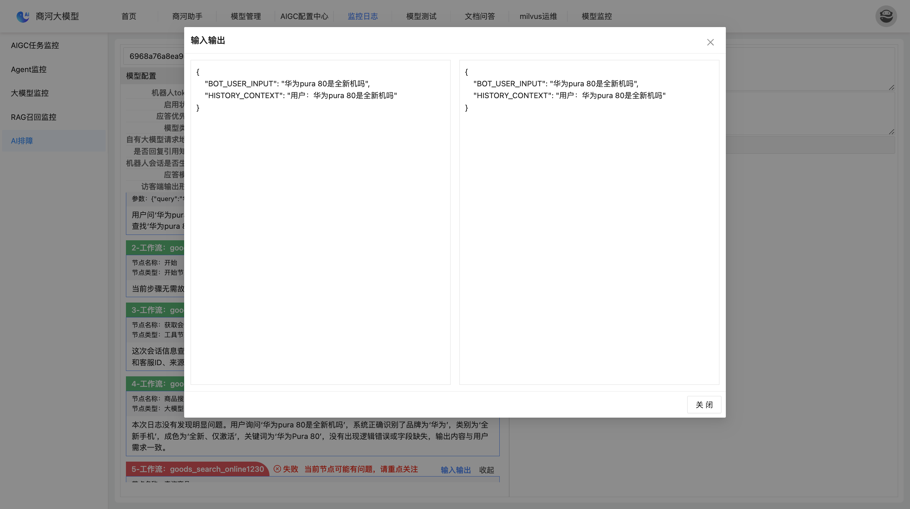

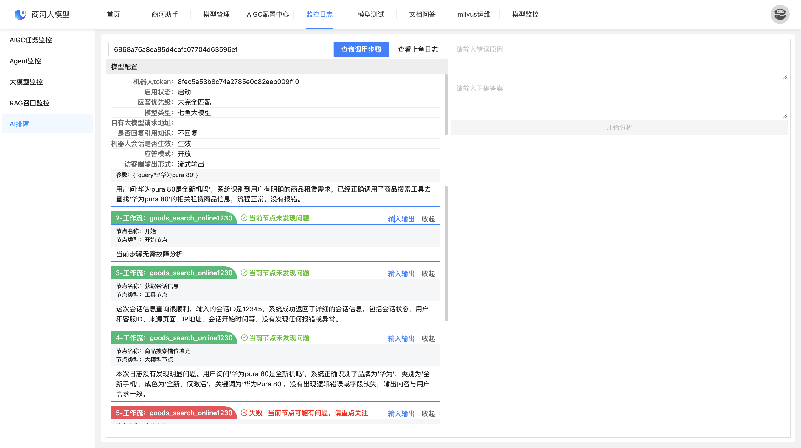

  |

## 五、说在前面

需要的核心能力需要包括：

| 功能点 | 优先级 |
| --- | --- |
| 工作流试运行的入口 | P0 |
| 工作流试运行的启动 | P0 |
| 在【画布中】查看节点运行详情 | P0 |
| 在【调试与预览面板中】查看节点运行详情 | P1 |
| 扣费规则 | P0 |

## 六、需求描述

## 1、工作流试运行的入口

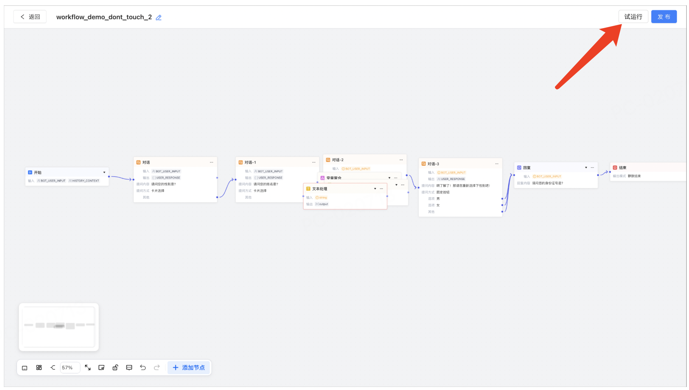

## 2、工作流试运行的启动

1

-   点击【试运行】弹出【调试与预览】面板，需要先输入【试运行输入】

1

-   展示的是【开始节点】的【自定义输入参数】，包括：名称、是否必填、参数类型

1

-   在该弹窗右上角支持输入【会话ID】模拟用户进线

1

-   在该弹窗右上角显示【关闭键】，点击后立即退出【工作流试运行】，且【试运行按钮】恢复【高亮可点击状态】

1

-   点击【保存并开始对话】后，立即显示对话框，对话框内容为空时，需要显示文案【请开始对话...】，同时【试运行按钮】置灰

1

-   弹出的【调试与预览】面板可以用【Agent调试窗口】的对话组件，用户在【调试与预览】面板中输入内容后，需要立即调起当前工组流，从【开始节点】进行运行

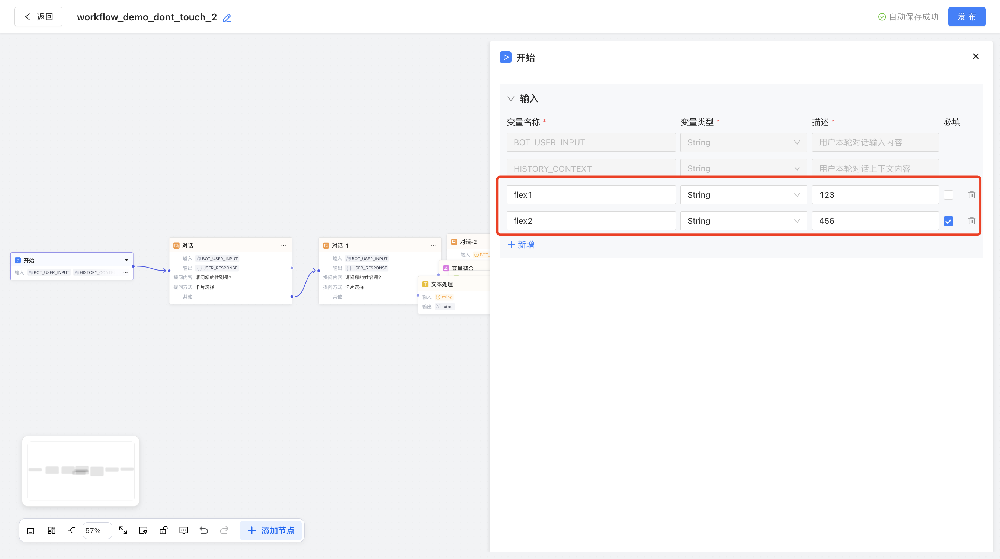

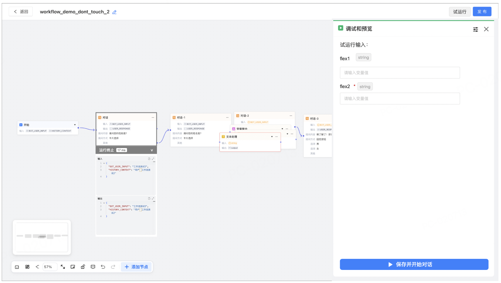

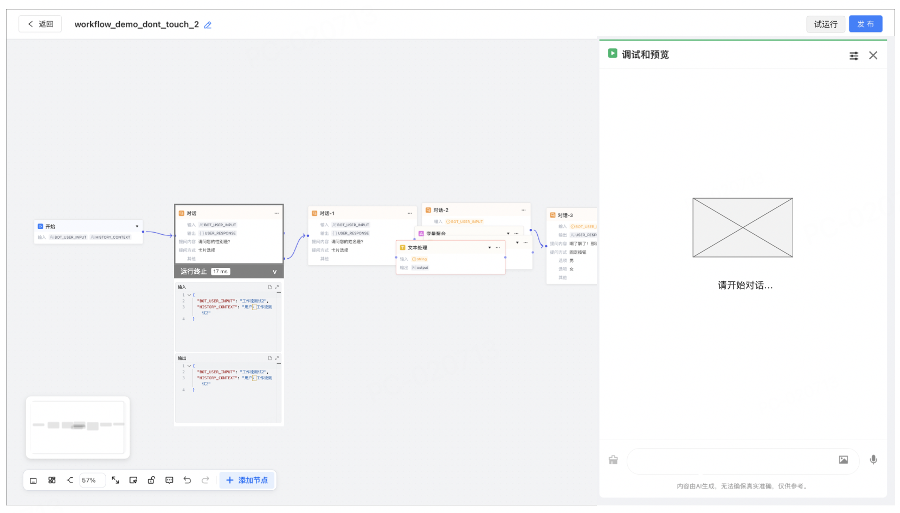

## 3、在【画布中】查看节点运行详情

1

-   在左侧画布中，需要实时看到画布【当前流转到了哪个节点】和【历史流经了哪些节点】。并可见对应节点的【节点运行状态】和【节点运行日志】；

1

-   若 工作流全局调度 使得工作流跳转回了某个前序对话节点时，画布需要展示最新的【当前流转到了哪个节点】和【历史流经了哪些节点】；

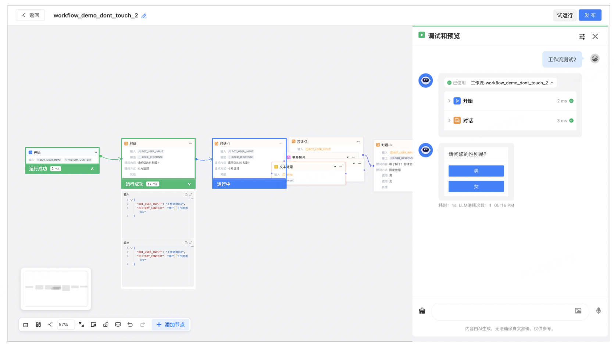

| 类型 | 相关截图 | 说明 |
| --- | --- | --- |
| 节点运行状态 |   
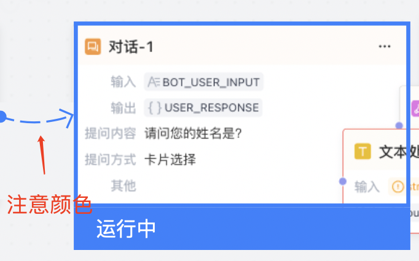

 

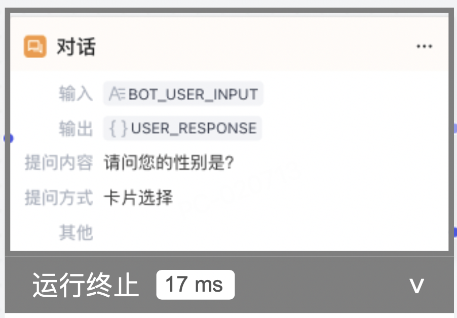

 | 1【完成运行的节点】需要显示为绿色，展示内容包括包括：1运行状态：运行成功1运行时长：xxx ms1节点运行日志：支持展开查看，默认收起1【终止运行的节点】需要显示为灰色，展示内容包括包括：1运行状态：运行终止1运行时长：xxx ms1节点运行日志：支持展开查看，默认收起1⚠️注意：【代码节点】可能会出现运行终止的情况1【代码节点】重试失败/直接终止1【运行中的节点】需要显示为蓝色，展示内容包括包括：1运行状态：运行中1运行时长：xxx ms1节点运行日志：展开收起icon需要隐藏 |
| 节点运行日志 | 

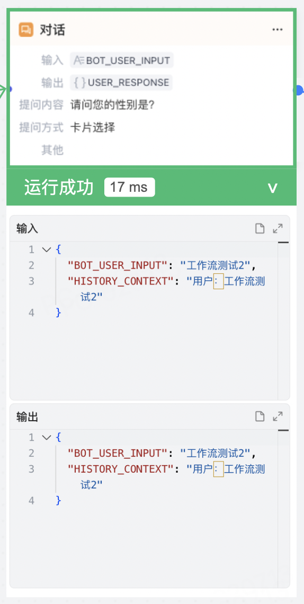

 | 1展开【节点运行日志】，日志需要显示该节点的【输入】和【输出】1支持针对【输入】和【输出】的内容进行【复制】和【展开查看】 |

## 4、在【调试与预览面板中】查看节点运行详情

1

-   在右侧的【调试与预览面板】中，也可以看到【节点运行状态】和【节点运行日志】，这块可以完全参考【Agent调试窗口】中的【调用日志】，在这里不再赘述

1

-   ⚠️需要注意的是：若 工作流全局调度 使得工作流跳转回了某个前序对话节点时，右侧的【调用日志】需要展示【工作流之前流经节点的日志内容】，以及【工作流全局调度的日志内容】

1

-   【工作流全局调度的日志内容】详见本期需求：[【智能】Agent工作流全局调度调试日志](https://docs.popo.netease.com/team/pc/r17pusa6/pageDetail/289d8cc75a3040c980eb41e693a4053f)

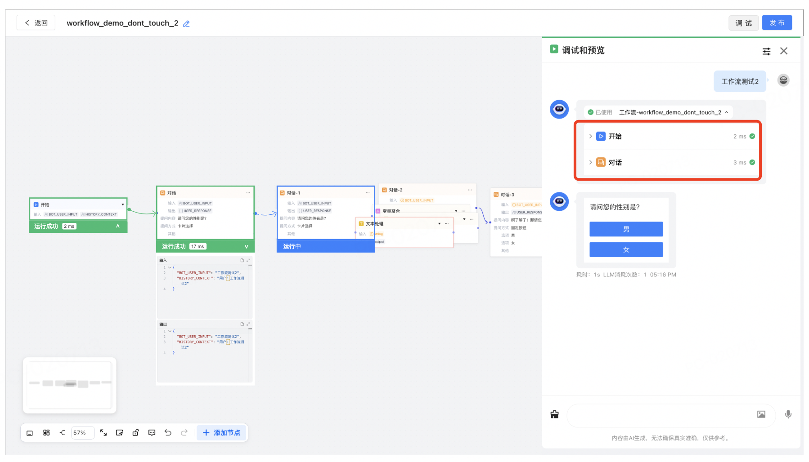

## 5、扣费规则

1

-   【工作流试运行】所产生的费用需要和客户收，收费规则同用户在【Agent调试窗口】中的调用收费逻辑，在此处不再赘述；